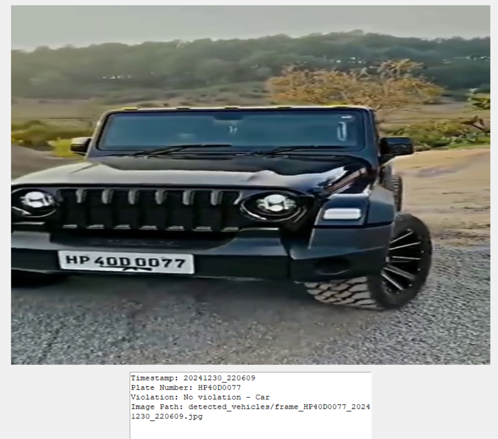
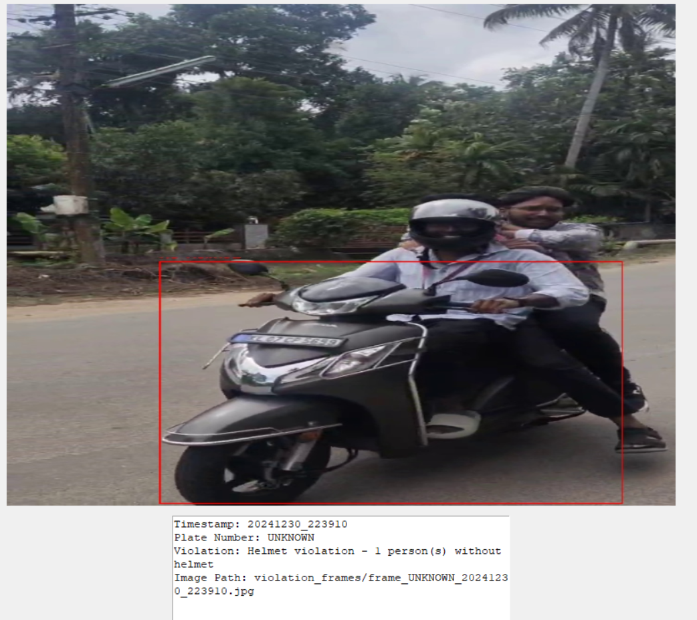

# vehicle-identification-with-yolov8-and-cloud

A real-time system for detecting vehicles, license plates, and traffic violations using yolov8,custom trained yolov8 and cloud.

## Features

- License Plate Detection and Recognition
- Vehicle Type Classification (Two-wheelers/Cars)
- Helmet Usage Detection
- Triple Riding Detection
- Automated Vehicle Information Retrieval
- Real-time Violation Monitoring
- CSV Logging System
- Frame Capture and Storage
- seat belt violations (to be done)
- implementation in cloud (to be done)

## Requirements

- Python 3.8+
- CUDA-compatible GPU (recommended)
- Webcam or Video Input
- Cloud
## Installation

1. Clone the repository
```bash
git clone https://github.com/jacobjohnxn/vehicle-identification-with-yolov8-and-cloud.git
cd vehicle-identification-with-yolov8-and-cloud
```
2.Install dependencies
```bash
pip install -r requirements.txt
```

3. Set the models
Place YOLOv8 models in the project root directory
Ensure Indian license plate model is present

4.Usage
Run the main script:
```bash
python vehicle_detection_system.py
```

Project Structure
vehicle-detection-system/
├── vehicle_detection_system.py
├── requirements.txt
├── detected_vehicles/
├── violation_frames/
├── vehicle_data.csv
└── models/
    ├── trainedindianplate.pt
└── yolov8n.pt
└── testvideo.mp4

Output
Detected vehicles saved in 'detected_vehicles' folder
Violations saved in 'violation_frames' folder
Vehicle data logged in 'vehicle_data.csv'

## Output Examples

### License Plate Detection of car


### Helmet Violation Detection in bike



